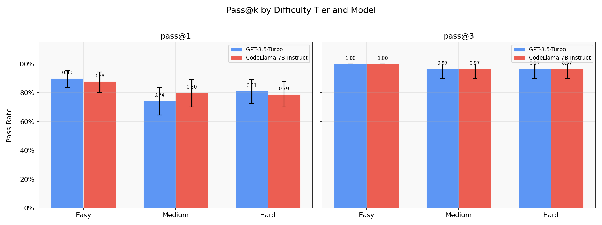
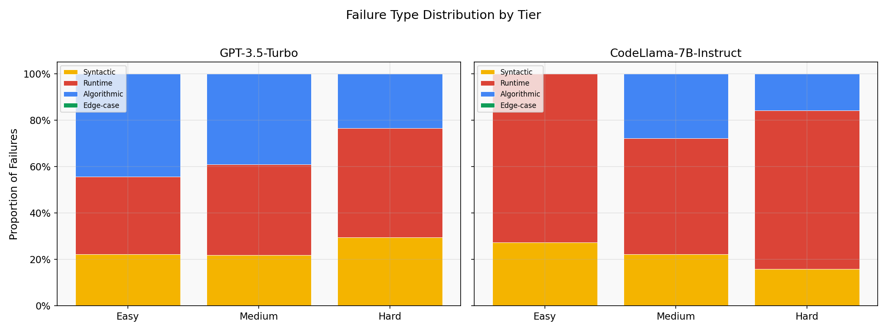
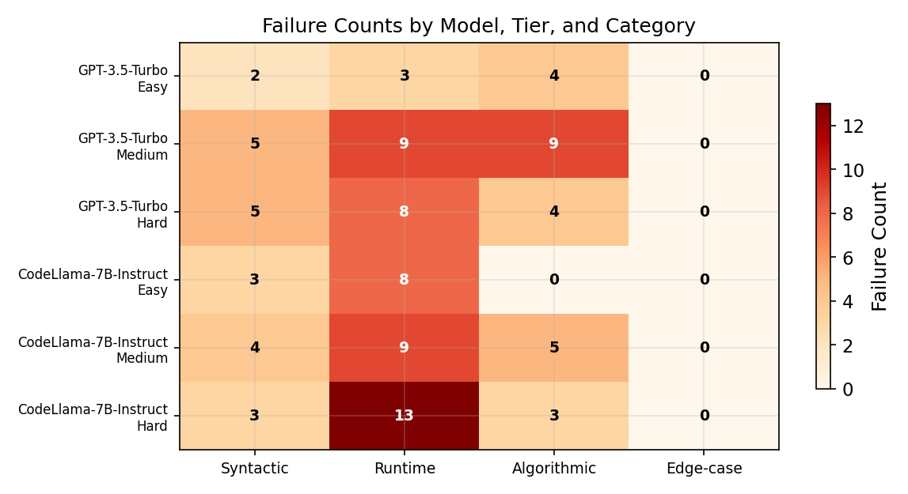
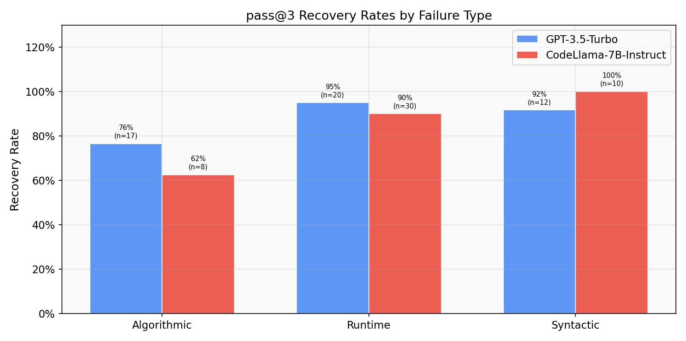
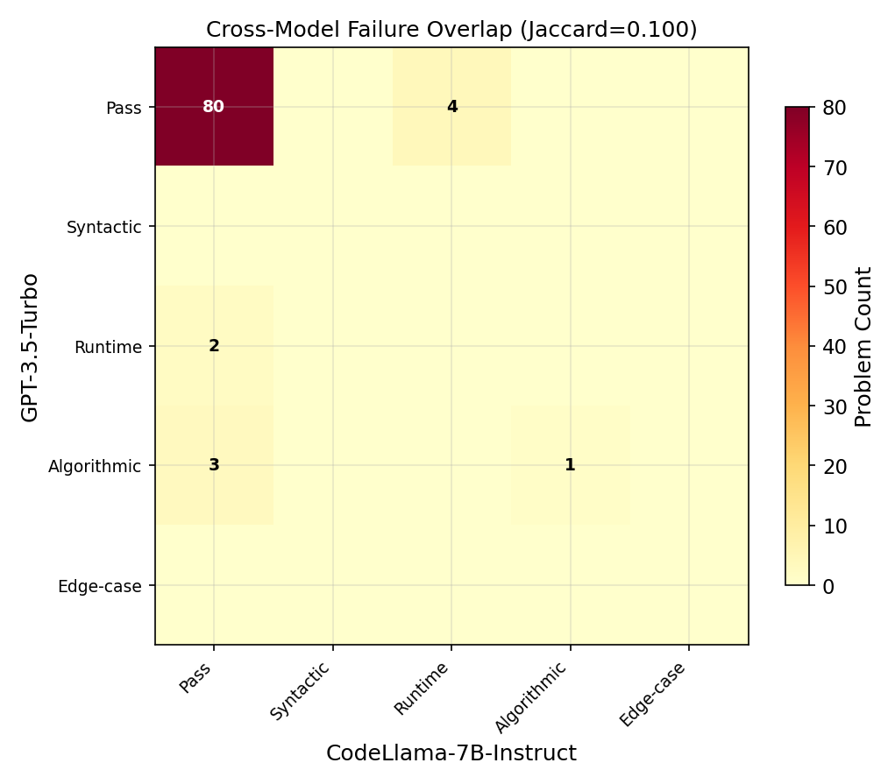
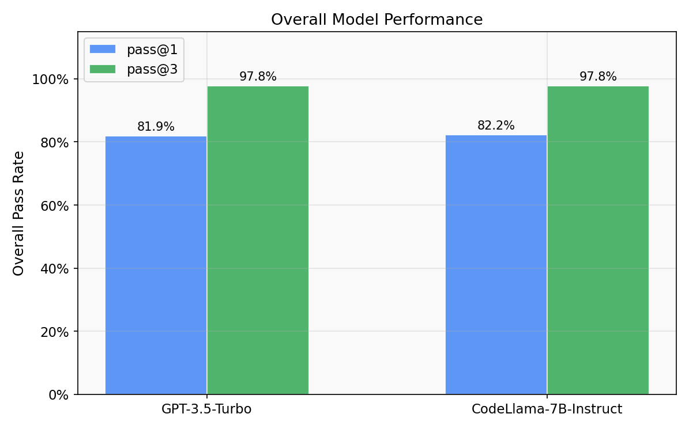

# Benchmarking Code Correctness in Large Language Models

### A Failure-Mode Analysis Across Difficulty and Model Scale

> **CSCI-4364/6364 S26 — Machine Learning**
> George Washington University · Department of Computer Science

**Abenezer Golda** · **Abiy Mamo** · **Rufai Yakubu**

---

## Overview

Existing code-generation benchmarks like HumanEval report a single number — *"this model passes 67% of problems"* — which tells practitioners nothing about **how** or **where** models fail. A deployment team that learns 60% of failures are syntax errors (catchable by any linter) makes a very different decision than one that learns 60% of failures are silent algorithmic bugs that pass casual review.

This project constructs a **90-problem stratified Python benchmark**, evaluates **GPT-3.5-Turbo** and **CodeLlama-7B-Instruct** using the **pass@1** and **pass@3** metrics with bootstrap confidence intervals, and produces a **four-category failure taxonomy** classifying every error as **Syntactic**, **Runtime**, **Algorithmic**, or **Edge-case**.

### Key Findings

| Finding | Detail |
|---------|--------|
| pass@1 is **not monotonically declining** with difficulty | Both models show lowest pass@1 at Medium, not Hard |
| Failure composition **shifts across tiers** | Algorithmic failures peak at Medium (28–39%); Runtime dominates Easy and Hard |
| pass@3 **preferentially recovers** surface errors | Syntactic/Runtime: 90–100% recovery; Algorithmic: 62–76% |
| Models fail on **largely distinct problems** | Cross-model Jaccard overlap = 0.10, suggesting ensemble potential |

---

## Results

### Pass@1 by Difficulty Tier

GPT-3.5-Turbo outperforms CodeLlama-7B across tiers, but the gap is modest. Notably, **Medium difficulty produces the lowest pass rates** for GPT-3.5, likely because Medium problems require novel algorithmic reasoning while some Hard problems test well-known patterns present in training data.



| Tier | GPT-3.5 pass@1 | CodeLlama pass@1 |
|------|----------------|------------------|
| Easy | 0.900 | 0.878 |
| Medium | 0.744 | 0.800 |
| Hard | 0.811 | 0.789 |

### Failure Taxonomy Distribution

The stacked bar chart reveals how failure composition shifts across tiers. Runtime errors dominate at Easy and Hard, while Medium shows the highest proportion of Algorithmic failures — problems where the model produces wrong output on standard tests.



### Failure Count Heatgrid

A granular view of raw failure counts across all (model, tier, category) combinations:



### Pass@3 Recovery Rates

When sampling three times instead of once, **Syntactic and Runtime errors are almost always recovered** (90–100%), while **Algorithmic failures persist** (62–76% recovery). This means multi-sample aggregation helps with surface errors but provides limited improvement on core reasoning failures.



### Cross-Model Failure Overlap

Despite producing similar aggregate failure distributions, the two models **fail on largely distinct problems** (Jaccard = 0.10). An ensemble of both models would likely outperform either alone.



### Overall Model Comparison



---

## Repository Structure

```
├── benchmark/
│   ├── benchmark.json              # 90 problems × 7+ test cases = 630 tests
│   └── generate_benchmark.py       # Builds & validates the benchmark
│
├── src/
│   ├── api_caller.py               # OpenAI + Together.ai clients (retry, cache, mock)
│   ├── executor.py                 # Sandboxed subprocess execution (5s timeout)
│   ├── failure_classifier.py       # 4-category hierarchical taxonomy
│   ├── metrics.py                  # pass@k, bootstrap CIs, Jaccard overlap
│   ├── prompt_formatter.py         # Model-specific prompt construction
│   └── response_parser.py          # Multi-strategy code extraction from model output
│
├── eval_harness.py                 # Main pipeline orchestrator
├── generate_charts.py              # 6 publication charts + findings.md
├── validate_classifier.py          # Manual validation + Cohen's kappa
│
├── results/
│   ├── results_raw.csv             # 540 rows (90 × 2 models × 3 samples)
│   ├── analysis.json               # Complete computed analysis
│   └── validation_sample.csv       # Stratified sample for manual review
│
├── charts/
│   ├── pass_at_k.png               # pass@1 and pass@3 by tier (with CI error bars)
│   ├── failure_taxonomy.png        # Failure type proportions by tier
│   ├── failure_heatgrid.png        # Failure count matrix
│   ├── overlap_heatmap.png         # Cross-model failure overlap
│   ├── recovery_rates.png          # pass@3 recovery by failure type
│   ├── overall_comparison.png      # Overall model comparison
│   └── findings.md                 # Auto-generated findings for all 4 RQs
│
├── report/
│   └── Project9_Report.pdf        # Final project report
│
├── config.py                       # All settings (API keys, paths, params)
├── run.sh                          # One-command pipeline runner
├── requirements.txt                # Python dependencies
├── .env.example                    # API key template
└── .gitignore
```

---

## Quick Start

### 1. Clone and set up

```bash
git clone https://github.com/YOUR_USERNAME/code-correctness-benchmark.git
cd code-correctness-benchmark

python3 -m venv venv
source venv/bin/activate
pip install -r requirements.txt
```

### 2. Run with mock data (no API keys needed)

```bash
chmod +x run.sh
./run.sh mock
```

This runs the full pipeline with simulated API responses — no money spent, no keys required. You'll get all 540 result rows, 6 charts, and the findings report.

### 3. Run with real APIs

```bash
cp .env.example .env
# Edit .env with your OpenAI and Together.ai API keys
./run.sh full
```

**Cost:** ~$5 for GPT-3.5-Turbo + ~$0.50 for CodeLlama via Together.ai = **under $7 total**.

All raw API responses are cached to `raw_responses/` — if the script crashes, re-run and it picks up where it left off.

---

## Pipeline Modes

| Command | What it does |
|---------|-------------|
| `./run.sh mock` | Full pipeline with simulated responses (free) |
| `./run.sh full` | Full pipeline with real API calls (~$7) |
| `./run.sh analyze` | Re-run analysis on existing `results_raw.csv` |
| `./run.sh charts` | Regenerate charts from `analysis.json` |
| `./run.sh validate` | Export 10% stratified sample for manual review |
| `./run.sh all` | Same as `mock` — full end-to-end test |

---

## Methodology

### Benchmark Design

| Property | Detail |
|----------|--------|
| Total problems | 90 (30 Easy + 30 Medium + 30 Hard) |
| Difficulty calibration | LeetCode community-verified taxonomy |
| Sources | HumanEval, MBPP, 15 original problems |
| Tests per problem | ≥ 7 (3 standard + 2 boundary + 2 adversarial) |
| Total test cases | 630 (all validated against canonical solutions) |

The **adversarial test cases** are the key innovation: they catch "almost correct" solutions that pass standard tests but fail on edge cases (off-by-one errors, empty inputs, duplicate handling, mutation of arguments).

### Evaluation Pipeline

```
┌─────────────┐    ┌──────────────┐    ┌─────────────┐    ┌──────────────┐
│   Prompt     │───>│   API Call   │───>│  Sandboxed   │───>│   Failure    │
│  Formatter   │    │  (3 samples) │    │  Executor    │    │  Classifier  │
└─────────────┘    └──────────────┘    └─────────────┘    └──────────────┘
  Model-specific      Retry/backoff      5s timeout          Hierarchical:
  chat templates       + caching         deep-copy inputs    Syn→Run→Alg→Edge
```

### Failure Taxonomy

| Category | Definition | Example |
|----------|-----------|---------|
| **Syntactic** | Code doesn't compile (SyntaxError, NameError) | Missing colon, undefined variable |
| **Runtime** | Crashes during execution | IndexError, ZeroDivisionError, Timeout |
| **Algorithmic** | Wrong output on standard tests | Incorrect logic, wrong algorithm |
| **Edge-case** | Passes standard tests, fails on boundary/adversarial | Off-by-one, empty input not handled |

Classification is **hierarchical** — earlier categories take priority, ensuring mutual exclusivity.

### Metrics

- **pass@k** via the unbiased combinatorial estimator of Chen et al. (2021): `pass@k = 1 − C(n−c, k) / C(n, k)`
- **95% bootstrap confidence intervals** (1,000 resamples at the problem level)
- **Failure proportions** per (model, tier) cell
- **Cross-model Jaccard similarity** on failure sets
- **pass@3 recovery rate** per failure category

---

## Research Questions

### RQ1: Does pass@1 decline monotonically with difficulty?

**No.** GPT-3.5 shows Easy (0.900) > Hard (0.811) > Medium (0.744). Medium problems requiring novel algorithmic reasoning are harder for models than some Hard problems testing well-known patterns from training data.

### RQ2: Does failure composition shift across tiers?

**Yes.** Runtime errors dominate Easy and Hard (33–73%), while Medium shows the highest Algorithmic failure proportion (28–39%). Edge-case failures are rare across all conditions — when models fail, they fail obviously.

### RQ3: Does pass@3 preferentially recover specific failure types?

**Yes.** Syntactic errors: 92–100% recovered. Runtime errors: 90–95% recovered. Algorithmic errors: only 62–76% recovered. Surface errors are stochastic flukes; algorithmic failures indicate consistent misunderstanding.

### RQ4: Is there a model-scale effect on failure distribution?

**Partially.** The aggregate distributions are similar (both dominated by Runtime), but the models fail on **different specific problems** (Jaccard = 0.10). Scale affects *which* problems are hard, not *what kind* of error is made.

---

## Classifier Validation

To validate the automated failure classifier:

```bash
# Step 1: Export a stratified 10% sample
python3 validate_classifier.py --export

# Step 2: Fill in 'manual_label' column in results/validation_sample.csv

# Step 3: Compute agreement statistics
python3 validate_classifier.py --score
```

Reports: percent agreement, Cohen's kappa, confusion matrix, and per-category precision/recall/F1.

---

## References

1. Chen, M., et al. (2021). *Evaluating Large Language Models Trained on Code.* arXiv:2107.03374.
2. Austin, J., et al. (2021). *Program Synthesis with Large Language Models.* arXiv:2108.07732.
3. Liu, J., et al. (2023). *Is Your Code Generated by ChatGPT Really Correct?* NeurIPS 2023.
4. Jain, N., et al. (2024). *LiveCodeBench: Holistic and Contamination Free Evaluation of LLMs for Code.* arXiv:2403.07974.
5. Nguyen, N. & Nadi, S. (2022). *An Empirical Evaluation of GitHub Copilot's Code Suggestions.* MSR 2022.
6. Pearce, H., et al. (2022). *Asleep at the Keyboard? Assessing the Security of GitHub Copilot's Code Contributions.* IEEE S&P 2022.
7. Roziere, B., et al. (2023). *Code Llama: Open Foundation Models for Code.* arXiv:2308.12950.
8. Efron, B. & Tibshirani, R.J. (1993). *An Introduction to the Bootstrap.* Chapman and Hall/CRC.
9. Landis, J.R. & Koch, G.G. (1977). *The Measurement of Observer Agreement for Categorical Data.* Biometrics, 33(1).
10. GitHub. (2023). *The State of the Octoverse 2023.* https://octoverse.github.com/

---

## License

This project was developed as a course project for CSCI-4364/6364 (Machine Learning) at George Washington University. The benchmark problems adapted from HumanEval and MBPP retain their original licenses. Original problems and all code are available for academic use.
